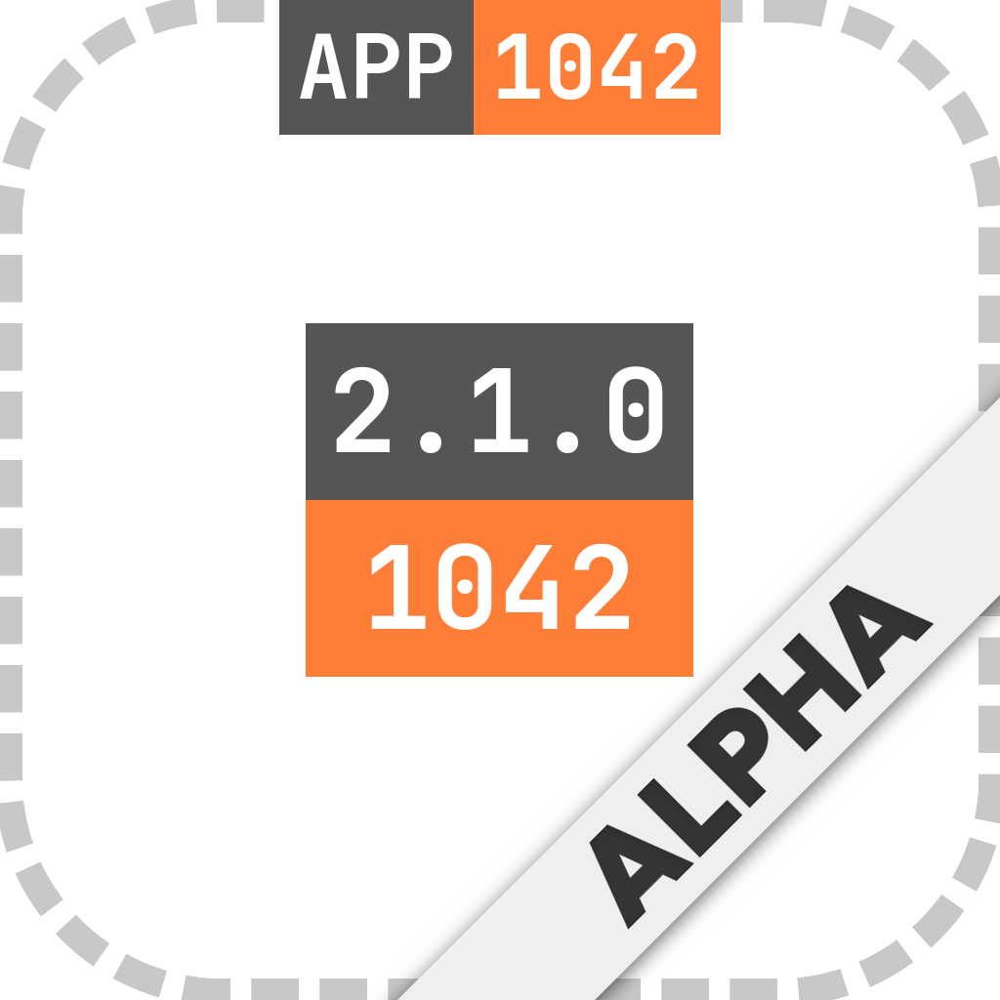
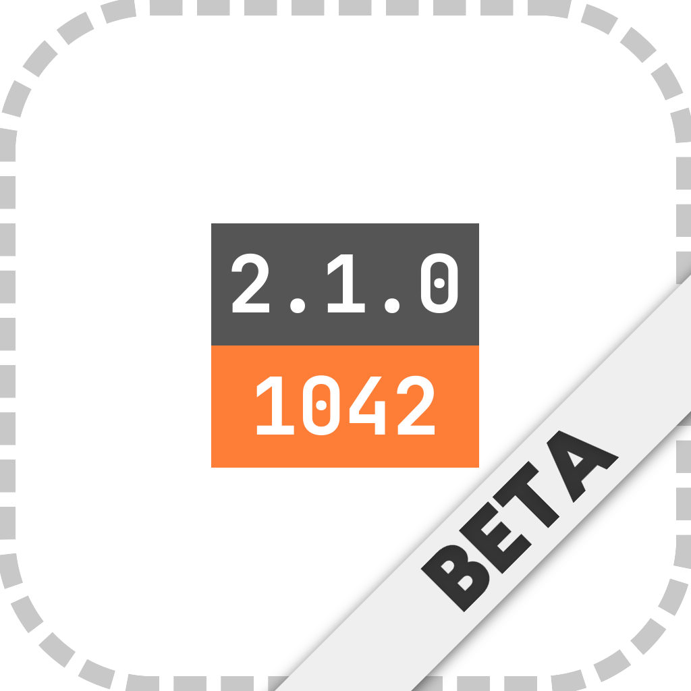
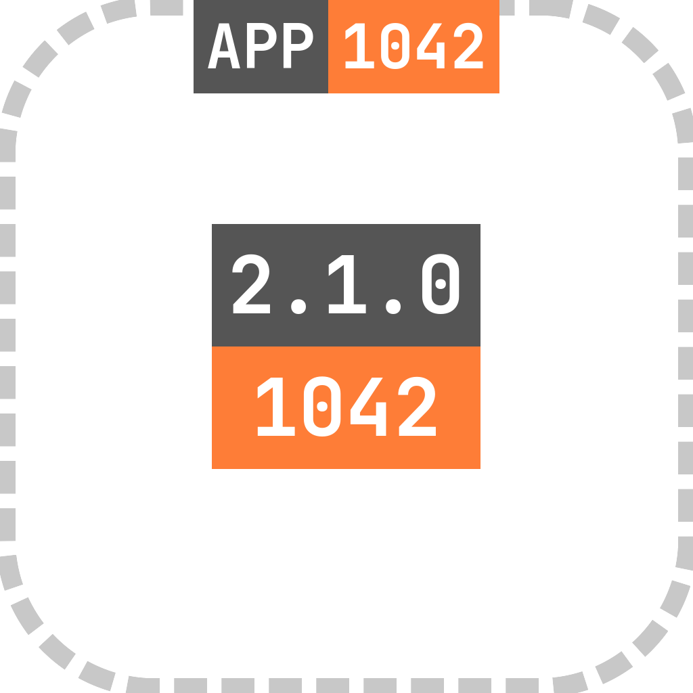
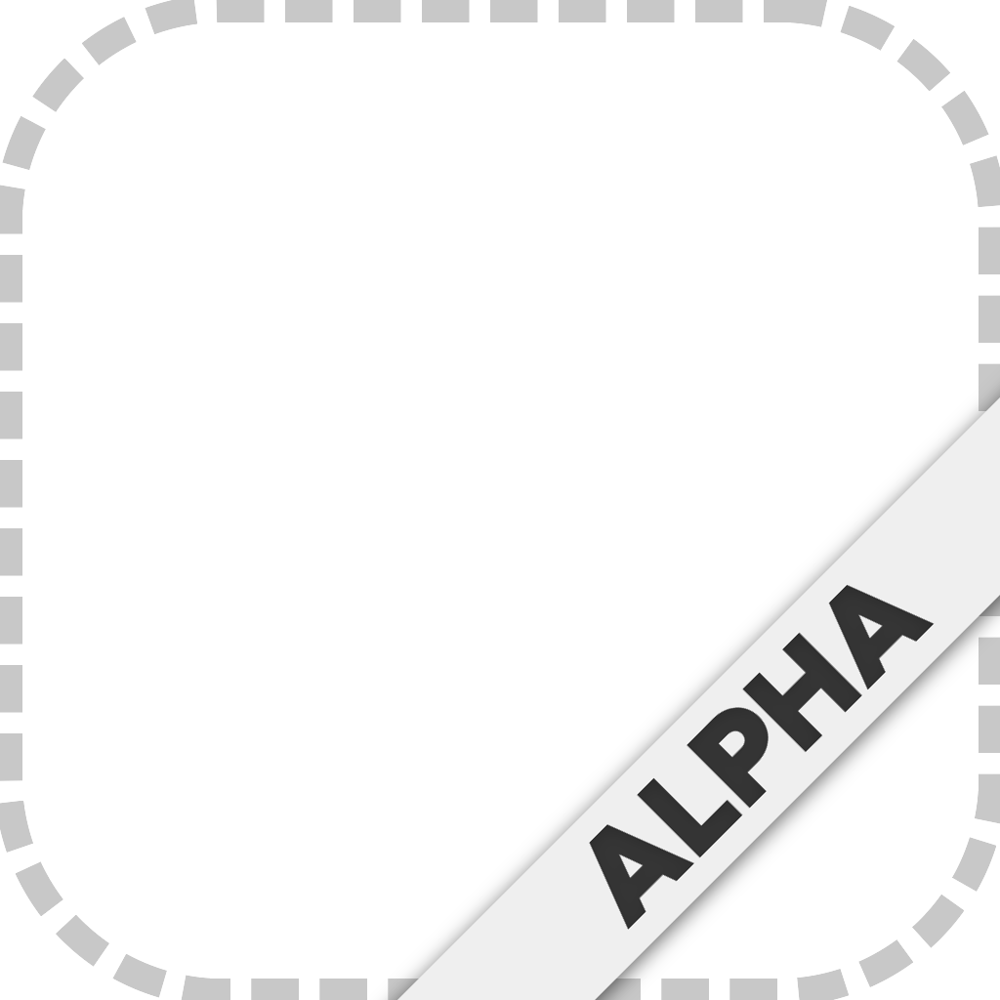
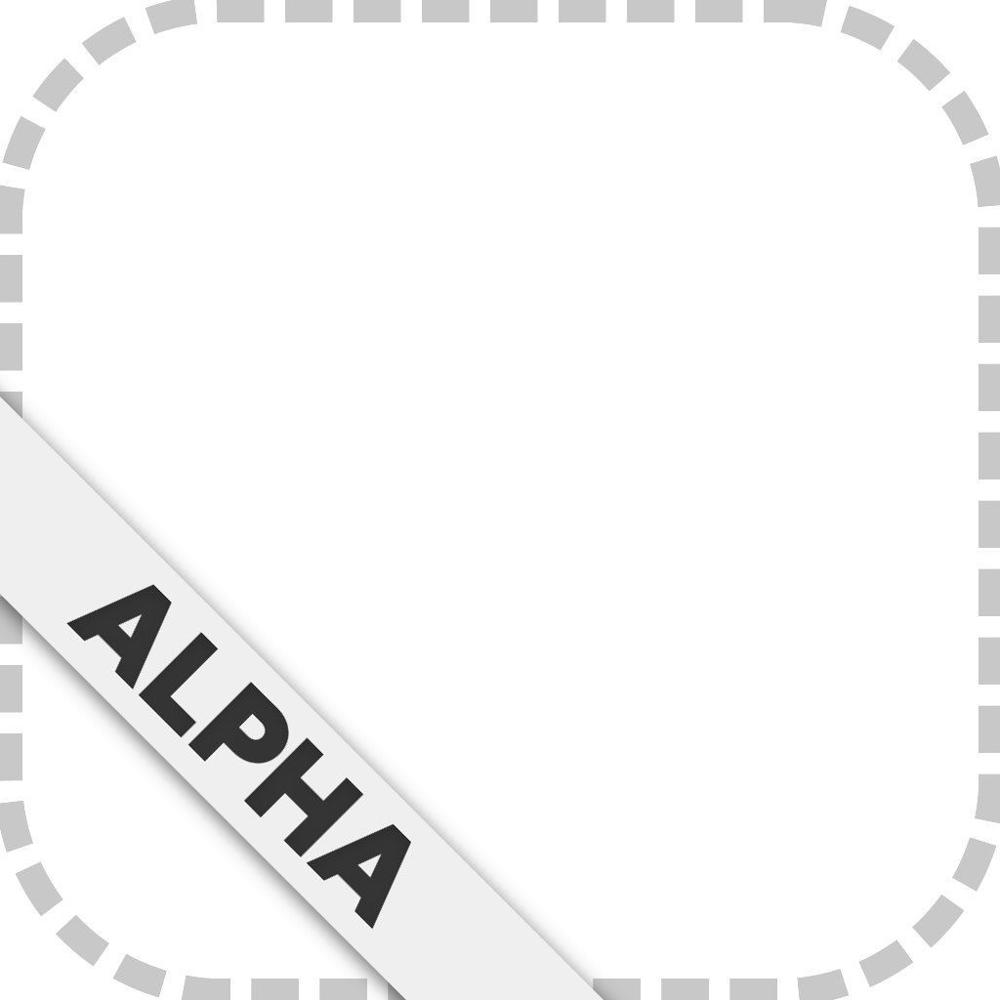
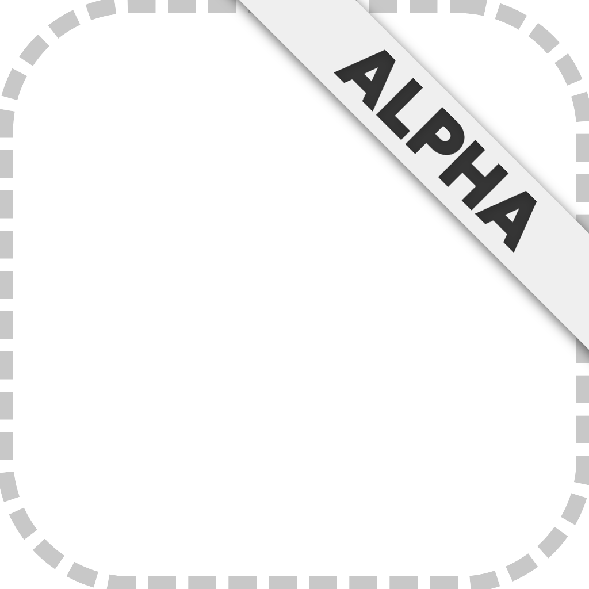
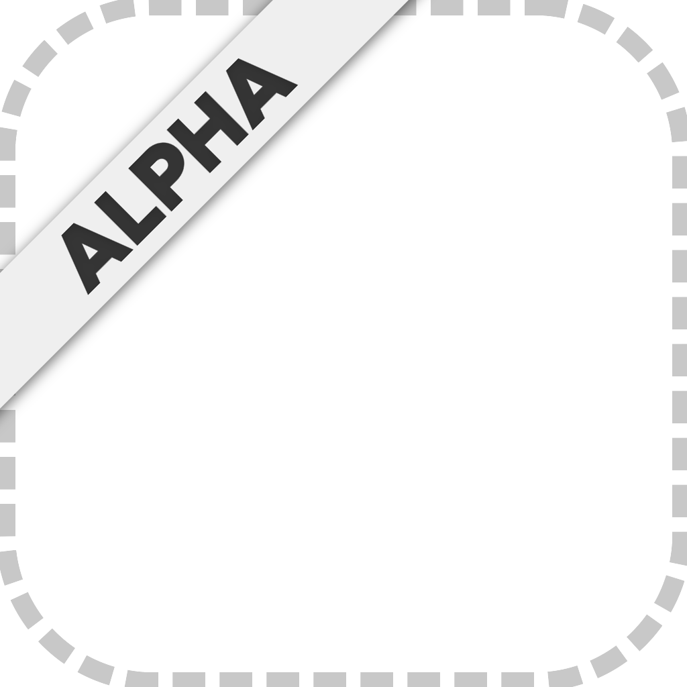
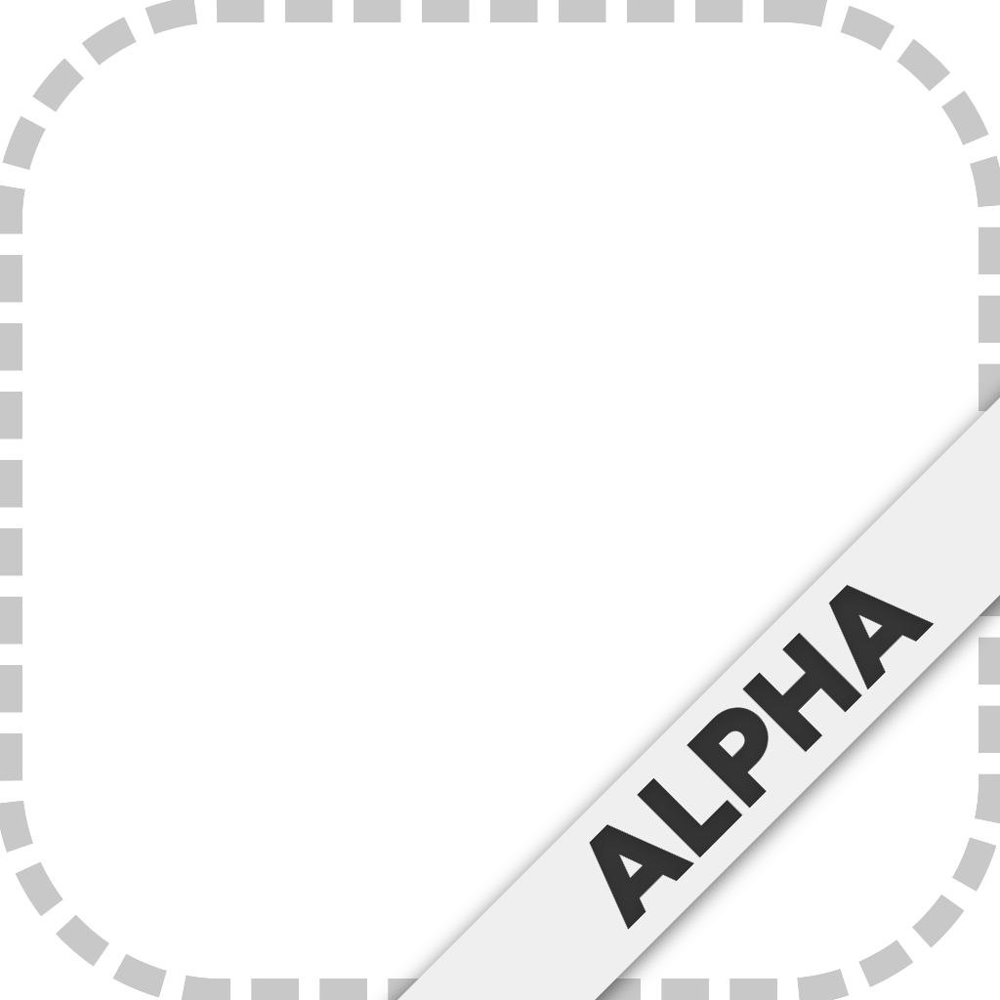
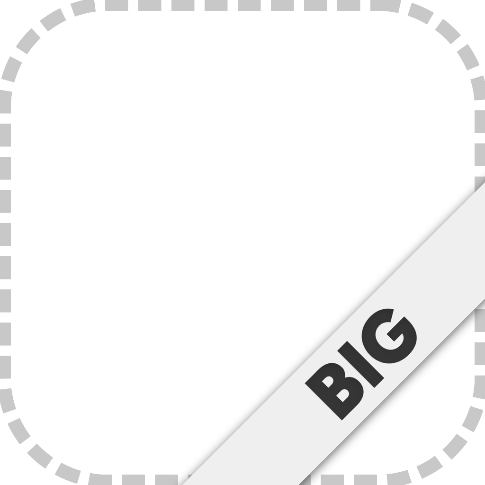
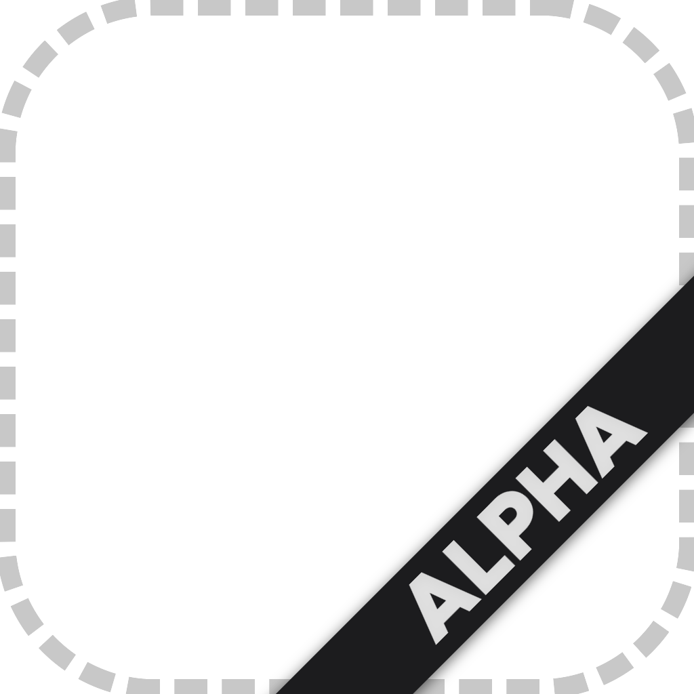

# fastlane-plugin-badger

A fastlane plugin that composites text badges and diagonal corner ribbon banners
onto your app icons at build time — using ImageMagick locally. No network calls.
No static PNGs committed to the repo.

Works identically on developer machines and CI. All rendering is done by the
`magick` binary via [mini_magick](https://github.com/minimagick/minimagick).

## Examples

| `north_left` + `north_right` + `center_top` + `center_bottom` + `corner` | `center_top` + `center_bottom` + `corner` | `corner` only |
|:---:|:---:|:---:|
|  |  |  |

## Anatomy

**Badge slots** — `north_left` (grey) · `north_right` (orange) · `center_top` (grey) · `center_bottom` (orange):



**`corner`** — `bottom_right` · `bottom_left` · `top_right` · `top_left`:

| `bottom_right` | `bottom_left` | `top_right` | `top_left` |
|:---:|:---:|:---:|:---:|
|  |  |  |  |

**`size`** — `normal` (ribbon = 14% of icon) · `large` (ribbon = 17% of icon):

| `size: :normal` | `size: :large` |
|:---:|:---:|
|  |  |

**`style`** — `light` (`#efefef` bg, dark text) · `dark` (`#1c1c1e` bg, white text):

| `style: :light` | `style: :dark` |
|:---:|:---:|
|  |  |

## Why badger?

Badger generates everything locally using ImageMagick — no network required,
works offline and on CI, resolution-independent at any icon size, supports
custom fonts (bundled OFL), and produces diagonal corner ribbon banners.

## Prerequisites

- **ImageMagick 7+** — the `magick` binary must be in `PATH`.
  ```sh
  brew install imagemagick   # macOS
  ```
- **Ruby 3.3+**
- **mini_magick** gem (declared as a dependency, installed automatically)

## Installation

Add to your `Pluginfile`:

```ruby
# Pluginfile
gem "fastlane-plugin-badger", git: "https://github.com/rpulivella/fastlane-plugin-badger"
```

Then run:

```sh
bundle exec fastlane install_plugins
```

### Font setup

Badger ships with placeholder slots for two fonts. Copy them into
`assets/fonts/` inside the gem directory (or fork and commit them — both are
OFL-licensed so they are freely bundleable):

| File | Used for |
|---|---|
| `JetBrainsMonoNL-Bold.ttf` | North and Center text badges |
| `Figtree-Black.otf` | Corner ribbon banners |

**JetBrains Mono NL Bold** — [jetbrains.com/lp/mono](https://www.jetbrains.com/lp/mono/)
SIL Open Font License 1.1.

**Figtree Black** — [fonts.google.com/specimen/Figtree](https://fonts.google.com/specimen/Figtree)
SIL Open Font License 1.1.

Both fonts can be committed to your repo without attribution requirements
(check the individual license files to confirm for your use case).

## Badge slot layout

Badger uses a two-slot system. Each slot has two optional sub-slots with a
consistent color convention: **grey = secondary**, **orange = primary**.


- **North slot** — horizontal two-tone bar at the top of the icon
  - `north_left` → grey (#555555) segment on the left
  - `north_right` → orange (#fe7d37) segment on the right
- **Center slot** — vertical two-tone stack in the middle of the icon
  - `center_top` → grey (#555555) segment on top
  - `center_bottom` → orange (#fe7d37) segment on bottom

Both sub-slots in both positions are optional. Providing only one sub-slot
renders a single-color badge in that slot.

## Actions

### `stamp_version_badge`

Stamps the app version and build number into the **Center slot** as a vertical
two-tone stack — version on top (grey), build number on bottom (orange).

```
     [ 1.5.2 ]     ← grey
     [  6349 ]     ← orange
```

```ruby
stamp_version_badge(
  version:   "1.5.2",   # required if xcodeproj not provided
  build:     "6349",    # required if xcodeproj not provided
  xcodeproj: "MyApp/MyApp.xcodeproj",  # optional — auto-reads version/build
  icon_glob: "**/AppIcon.appiconset/*.png"  # default
)
```

| Parameter | Type | Default | Description |
|---|---|---|---|
| `version` | String | — | App version string, e.g. `"1.5.2"`. Overrides xcodeproj. |
| `build` | String | — | Build number string, e.g. `"6349"`. Overrides xcodeproj. |
| `xcodeproj` | String | — | Path to `.xcodeproj` for auto-reading version/build. |
| `icon_glob` | String | `**/AppIcon.appiconset/*.png` | Glob to discover icons. |

### `stamp_label_badge`

Stamps a two-sub-slot horizontal badge into the **North slot** at the top of
every matched icon. Left segment is grey, right segment is orange. Either
sub-slot is optional.

```
  [ APP ] [ 2969 ]    ← grey | orange
```

```ruby
stamp_label_badge(
  north_left:  "APP",   # optional — grey left segment
  north_right: "2969",   # optional — orange right segment
  icon_glob:   "**/AppIcon.appiconset/*.png"  # default
)
```

| Parameter | Type | Default | Description |
|---|---|---|---|
| `north_left` | String | — | Grey left segment text, e.g. `"APP"`. |
| `north_right` | String | — | Orange right segment text, e.g. `"2969"`. |
| `icon_glob` | String | `**/AppIcon.appiconset/*.png` | Glob to discover icons. |

At least one of `north_left` or `north_right` must be provided.

### `stamp_corner_banner`

Stamps a diagonal corner ribbon (e.g. "ALPHA", "BETA", "NDA") over every
matched icon. The ribbon runs edge-to-edge — the canvas clips it naturally,
giving a clean built-in look without any pill shape.

```ruby
stamp_corner_banner(
  label:     "ALPHA",
  corner:    "bottom_right",  # default
  style:     "light",
  size:      "normal",        # default
  icon_glob: "**/AppIcon.appiconset/*.png"
)
```

| Parameter | Type | Default | Description |
|---|---|---|---|
| `label` | String | — | Ribbon text. Automatically uppercased. |
| `corner` | String | `"bottom_right"` | `bottom_right`, `bottom_left`, `top_right`, `top_left` |
| `style` | String | `"dark"` | `dark` — `#1c1c1e` bg, white 72% text. `light` — `#efefef` bg, dark 72% text. |
| `size` | String | `"normal"` | `normal` — ribbon = 14% of icon. `large` — ribbon = 17% of icon. |
| `icon_glob` | String | `**/AppIcon.appiconset/*.png` | Glob to discover icons. |

**`corner`** — `bottom_right` · `bottom_left` · `top_right` · `top_left`:

| `bottom_right` | `bottom_left` | `top_right` | `top_left` |
|:---:|:---:|:---:|:---:|
|  |  |  |  |

**`size`** — `normal` (14% of icon) · `large` (17% of icon):

| `size: :normal` | `size: :large` |
|:---:|:---:|
|  |  |

**`style`** — `light` (`#efefef` bg, dark text) · `dark` (`#1c1c1e` bg, white text):

| `style: :light` | `style: :dark` |
|:---:|:---:|
|  |  |

## Typical Fastfile usage

### Dev / alpha build (version + ticket + corner banner)

```ruby
lane :deploy_alpha do
  # Center: version (grey top) + build (orange bottom)
  stamp_version_badge(xcodeproj: "MyApp/MyApp.xcodeproj")

  # North: ticket prefix (grey left) + ticket number (orange right)
  ticket = ENV["BRANCH_NAME"]&.match(/(\d+)/)
  stamp_label_badge(north_left: "APP", north_right: ticket[1]) if ticket

  # Corner ribbon
  stamp_corner_banner(label: "ALPHA", style: "light")

  # ... build and distribute
end
```

### Beta build (version + corner banner)

```ruby
lane :deploy_beta do
  stamp_version_badge(xcodeproj: "MyApp/MyApp.xcodeproj")
  stamp_corner_banner(label: "BETA", style: "light")
  # ... build and distribute
end
```

### Corner banner only

```ruby
lane :deploy_open_beta do
  stamp_corner_banner(label: "BETA", style: "light")
  # ... build and distribute
end
```

## Corner banner design notes

The ribbon is generated in three passes:

1. **Solid rectangle** — fills the ribbon area with the background color.
2. **CopyOpacity mask** — renders white-bg / black-text, then uses
   `CopyOpacity` composite to punch transparent holes in the shape of each
   letter. White areas remain opaque ribbon; black areas become fully
   transparent.
3. **Re-annotate at 72% opacity** — fills the transparent holes with the text
   color at 72% opacity, letting a sliver of the background bleed through.
   This produces a subtle "knockout" feel that reads as softer than a flat
   fill.

The ribbon rectangle is 165% of the icon width so it always extends past both
canvas edges regardless of label length. ImageMagick clips at the canvas
boundary automatically.

A drop shadow (`60x10+0+5`) is applied to the rotated ribbon before it is
composited onto the icon canvas.

## Running tests

```sh
bundle exec rake spec
```

## License

MIT — see [LICENSE](LICENSE).

Font licenses:
- JetBrains Mono: SIL Open Font License 1.1
- Figtree: SIL Open Font License 1.1
